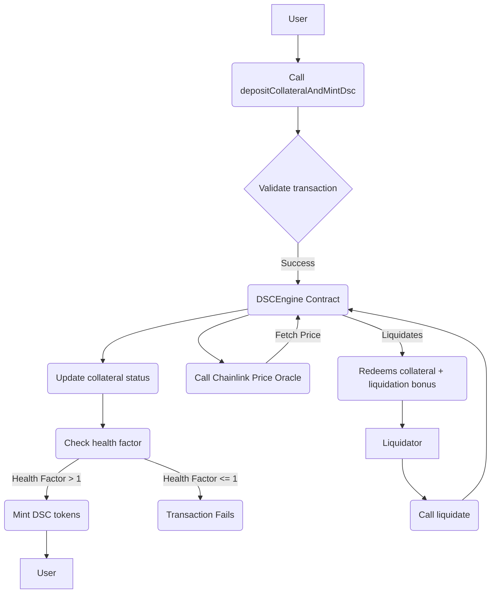

 

  

<h3 align="center"\>Decentralized Stablecoin (DeFi Stablecoin)</h3>
   

      A decentralized stablecoin system built with Solidity, Chainlink, and Foundry.
   

   
Table of Contents

   <ol>
      <li><a href="\#about-the-project"\>About The Project</a></li>
      <li><a href="\#features">Features</a></li>
      <li><a href="\#built-with">Built With</a></li>
      <li><a href="\#system-flowchart">System Flowchart</a></li>
      <li><a href="\#contracts">Contracts</a></li>
      <li><a href="\#deployment">Deployment</a></li>
   </ol>

---

## About The Project

This project implements a decentralized stablecoin (DSC) system, with the goal of creating a low-volatility coin pegged to the US Dollar. The stablecoin is backed by exogenous crypto collateral like ETH and BTC. The system is designed to be overcollateralized, meaning the total value of all collateral is always greater than the value of all minted DSC tokens.

The core logic, including minting, redeeming, and liquidating DSC, is managed by the `DSCEngine` contract. The project is a simplified version of systems like MakerDAO's DAI, built for a better understanding of the fundamental mechanisms.

### Features

- **Decentralized Stablecoin (DSC)**: An ERC20 token with the symbol "DSC".
- **Collateralized Debt Position**: Users deposit approved collateral (e.g., ETH, BTC) to mint DSC.
- **Overcollateralization**: A minimum health factor of `1e18` (100%) ensures the value of collateral is always greater than the minted debt.
- **Liquidation**: If a user's health factor drops below the threshold, their collateral can be liquidated to cover the debt.
- **Chainlink Price Feeds**: Relies on Chainlink oracles to fetch and validate real-time price data for collateral assets.

### Built With

- **Solidity**
- **Foundry**: The development framework for building, testing, and deploying the contracts.
- **Chainlink**: Provides decentralized oracle services for secure price feeds.
- **OpenZeppelin**: Used for secure and community-audited smart contract components like ERC20 and ReentrancyGuard.

<a href="\#readme-top">back to top</a>

---

## System Flowchart

Here is a flowchart illustrating the core interaction within the system.

<a href="\#readme-top">back to top</a>

---

## Contracts

### `DecentralizedStableCoin.sol`

This contract is the ERC20 implementation of the stablecoin itself. It's a mintable and burnable token, with ownership and control transferred to the `DSCEngine` contract after deployment to prevent unauthorized minting.

### `DSCEngine.sol`

This is the core logic contract that governs the stablecoin system. It manages collateral, calculates a user's health factor, and executes core functions like `depositCollateralAndMintDsc` and `redeemCollateralForDsc`. It uses the `OracleLib` to ensure price data is not stale before processing transactions.

### `OracleLib.sol`

A utility library designed to check the freshness of data from Chainlink price feeds. It reverts if a price is older than a specified timeout (`3 hours`), ensuring the system doesn't rely on outdated information.

<a href="\#readme-top">back to top</a>

---

## Deployment

The project includes deployment scripts written for Foundry. The `DeployDSC.s.sol` script orchestrates the deployment of both the `DecentralizedStableCoin` and `DSCEngine` contracts. It also sets up the Chainlink price feed addresses and transfers ownership of the DSC token to the newly deployed DSCEngine.

<a href="\#readme-top">back to top</a>

